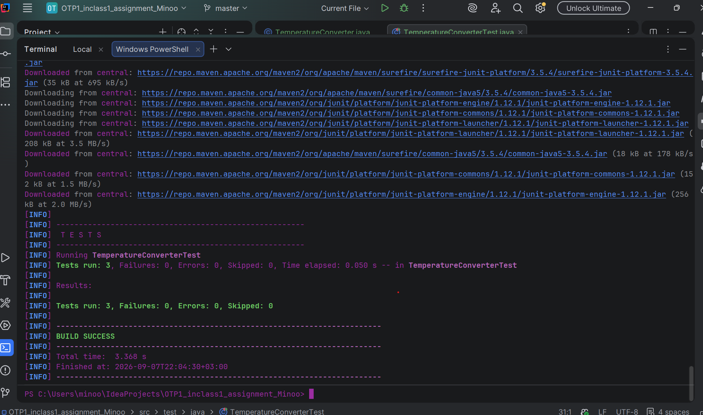
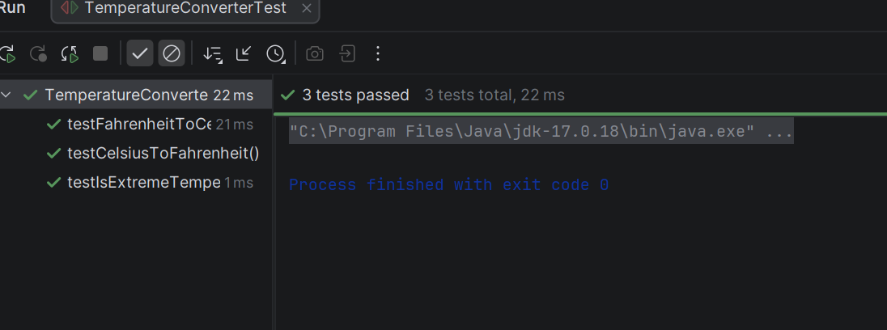

# Temperature Converter - JUnit Testing

This is my first in-class assignment for JUnit testing in IntelliJ.

The project has a simple `TemperatureConverter` class with methods for:
- Fahrenheit to Celsius
- Celsius to Fahrenheit
- Checking extreme temperatures

I wrote JUnit tests for the methods and tested different temperatures, including the boundary values.

## Test Results

All 3 tests passed.

